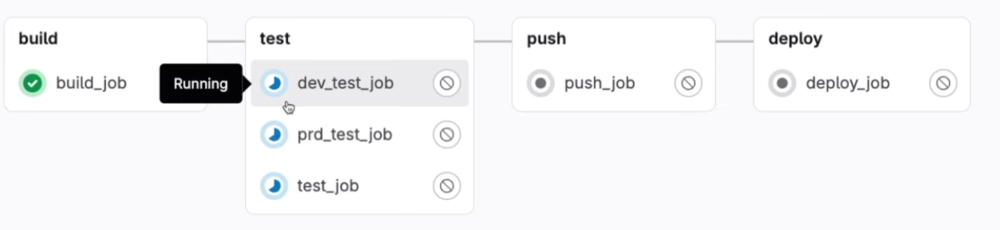
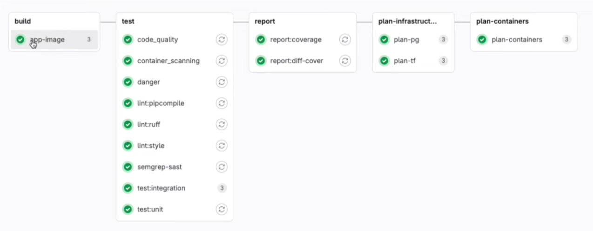

# GitLab CI/CD Learning Notes

## Table of Contents

- [Resources](#resources)
- [GitLab Runners](#gitlab-runners)
- [Variables](#variables)
- [Artifacts](#artifacts)
- [Shell Operators](#shell-operators)
- [Pipeline Examples](#pipeline-examples)

---

## Resources

### Official Documentation

- [Git Cheat Sheet](https://about.gitlab.com/images/press/git-cheat-sheet.pdf)
- [GitLab CI/CD Quick Start](https://docs.gitlab.com/ee/ci/quick_start/)

---

## GitLab Runners

### What are Runners?

GitLab Runners are agents that execute CI/CD jobs defined in your `.gitlab-ci.yml` file. They can be:

- **Shared Runners**: Available to all projects in a GitLab instance
- **Specific Runners**: Dedicated to specific projects
- **Group Runners**: Available to all projects in a group

### Key Concepts

#### 1. **Parallel Jobs**

- Multiple jobs can run simultaneously
- Enables faster pipeline execution
- Requires sufficient runner capacity

#### 2. **GitLab Parallel Runners**

- Multiple runners can execute jobs concurrently
- Improves build times significantly
- Load distribution across available runners



#### 3. **Runner Registration**

To register a runner to a project:

1. Navigate to **Settings → CI/CD → Runners** in your GitLab project
2. Copy the registration token
3. Run the registration command on your runner machine:

   ```bash
   gitlab-runner register
   ```

4. Provide the GitLab URL and token
5. Assign a **runner tag** for job targeting

#### 4. **Runner Tags**

- Tags allow you to target specific runners for specific jobs
- Example in `.gitlab-ci.yml`:

  ```yaml
  job_name:
    tags:
      - docker
      - linux
  ```

#### 5. **Self-Hosted Runners**

**Advantages:**

- Full control over infrastructure
- Custom environment setup
- No minute limitations
- Enhanced security for sensitive projects

**Setup:**

1. Install GitLab Runner on your server
2. Register the runner with your GitLab instance
3. Configure executor (shell, docker, kubernetes, etc.)

**Example Registration:**

```bash
sudo gitlab-runner register \
  --url https://gitlab.com/ \
  --registration-token YOUR_TOKEN \
  --description "my-runner" \
  --tag-list "docker,linux" \
  --executor docker \
  --docker-image alpine:latest
```

---

## Variables

### Types of Variables in GitLab CI/CD

#### 1. **Predefined Variables**

GitLab provides built-in variables automatically:

- `CI_COMMIT_SHA`: The commit SHA
- `CI_COMMIT_BRANCH`: The branch name
- `CI_PROJECT_NAME`: The project name
- `CI_PIPELINE_ID`: The pipeline ID
- `CI_JOB_NAME`: The job name

[Full list of predefined variables](https://docs.gitlab.com/ee/ci/variables/predefined_variables.html)

#### 2. **Protected Variables**

- Only exposed to protected branches/tags
- Used for sensitive data in production environments
- Set in **Settings → CI/CD → Variables**

#### 3. **Masked Variables**

- Values are hidden in job logs
- Prevents accidental exposure of secrets
- Must meet masking requirements (no spaces, special characters)

#### 4. **Expanded Variables**

- Variables can reference other variables
- Expansion happens at runtime
- Example:

  ```yaml
  variables:
    DOMAIN: example.com
    URL: https://$DOMAIN
  ```

**Variable Precedence** (highest to lowest):

1. Trigger variables
2. Scheduled pipeline variables
3. Manual pipeline run variables
4. Project variables
5. Group variables
6. Instance variables
7. Predefined variables

---

## Artifacts

### What are Artifacts?

Artifacts are files generated by a job that can be:

- Downloaded from the GitLab UI
- Passed to subsequent jobs in the pipeline
- Stored for a specified duration

### Common Use Cases

- Build outputs (compiled binaries, packages)
- Test results and coverage reports
- Documentation generated during build
- Log files for debugging

### Example Configuration

```yaml
build-job:
  script:
    - make build
  artifacts:
    paths:
      - build/
      - dist/
    expire_in: 1 week
    reports:
      junit: test-report.xml
```

### Artifact Settings

- **paths**: Files/directories to save
- **expire_in**: How long to keep (default: 30 days)
- **reports**: Special artifact types (junit, coverage, etc.)
- **when**: When to upload (on_success, on_failure, always)

---

## Shell Operators

### Output Redirection Operators

| Operator | Behavior | Description | Example |
| -------- | -------- | ----------- | ------- |
| `>`      | Overwrite | Replaces file content completely | `echo "new" > file.txt` |
| `>>`     | Append | Adds to end of file | `echo "add" >> file.txt` |

**Important for CI/CD:**

- Use `>` when creating new log files
- Use `>>` when aggregating logs from multiple commands

**Example in CI/CD:**

```yaml
test-job:
  script:
    - echo "Starting tests..." > test.log
    - npm test >> test.log
    - echo "Tests completed" >> test.log
```

### Other Useful Operators

- `|` (pipe): Pass output to another command
- `&&`: Execute next command only if previous succeeds
- `||`: Execute next command only if previous fails
- `2>&1`: Redirect stderr to stdout

---

## Pipeline Examples

### Real-World Pipeline Structure



### Typical Multi-Stage Pipeline

```yaml
stages:
  - build
  - test
  - deploy

build:
  stage: build
  script:
    - make build
  artifacts:
    paths:
      - build/

test:
  stage: test
  script:
    - make test
  dependencies:
    - build

deploy:
  stage: deploy
  script:
    - make deploy
  only:
    - main
  when: manual
```

---

## Advanced Topics

### Bash Logout Case

**Issue:** When using shell executor, runner sessions might persist
**Solution:**

- Use `after_script` to cleanup
- Ensure proper session termination
- Consider using Docker executor instead

**Example:**

```yaml
job:
  script:
    - run_my_script.sh
  after_script:
    - cleanup.sh
    - logout || true
```

---

## Best Practices

1. **Use Docker Executor** when possible for isolation
2. **Tag your runners** appropriately for job routing
3. **Protect sensitive variables** and enable masking
4. **Set reasonable artifact expiration** to save storage
5. **Use caching** to speed up repeated builds
6. **Implement proper error handling** in scripts
7. **Use `only/except` or `rules`** to control when jobs run
8. **Document your pipeline** with comments in `.gitlab-ci.yml`

---

## Quick Reference

### Adding Remote Repository

```bash
cd existing_repo
git remote add origin https://gitlab.com/MishraShardendu22/intro.git
git branch -M main
git push -uf origin main
```

### Common GitLab CI/CD Commands

```yaml
# Cache dependencies
cache:
  paths:
    - node_modules/

# Run only on specific branches
only:
  - main
  - develop

# Skip CI
git commit -m "message [ci skip]"
```

---

**Last Updated:** February 6, 2026
