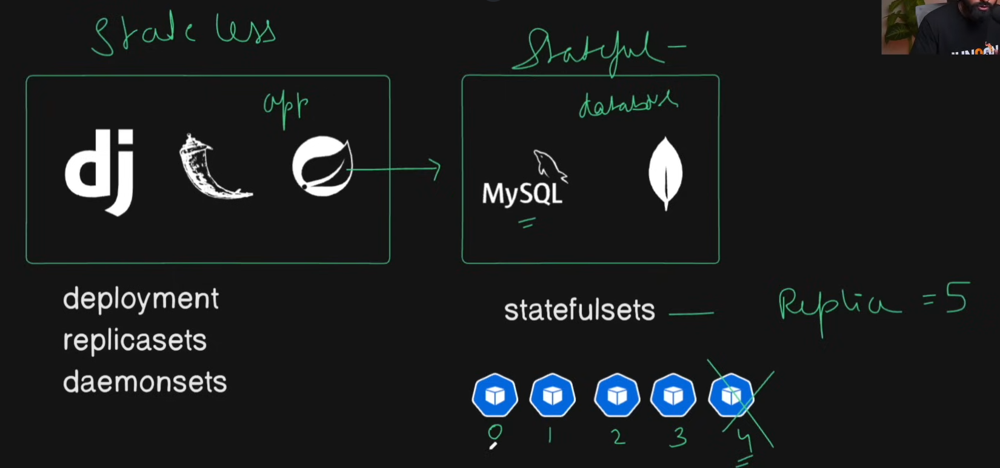

# Kubernetes Notes



## Architecture Overview

### Monolith vs Microservices

- **Monolith**: Single, unified application architecture
- **Microservices**: Distributed architecture with multiple independent services

### Cluster Terminology

- **Node**: A single server in the cluster
- **Cluster**: Multiple nodes (servers) working together
- **Master Node**: Control plane that manages the cluster
- **Worker Node**: Executes workloads (runs containers)

---

## Master Node (Control Plane)

The master node acts as the headquarters/main office that controls and coordinates all worker nodes.

### Key Components

#### 1. API Server

- Acts as the communication gateway for the entire cluster
- Entry point for all administrative tasks
- Handles all REST commands used to control the cluster

#### 2. etcd

- Distributed key-value database
- Stores all cluster configuration and state information
- Acts as the source of truth for the cluster

#### 3. Controller Manager

- Monitors the cluster state
- Ensures the desired state matches the actual state
- Manages various controllers (replication, endpoints, namespace, etc.)

#### 4. Scheduler

- Assigns pods to worker nodes
- Considers resource requirements, constraints, and availability
- Makes placement decisions for new pods

---

## Worker Node (Worker Plane)

Worker nodes are like branch offices that execute the actual workloads. They run Docker containers inside pods.

### Key Components -

#### 1. Kubelet

- Primary node agent running on each worker node
- Ensures containers are running in pods
- Communicates with the master node
- Manages pod lifecycle at the worker node level

#### 2. Kube-proxy

- Network proxy running on each node
- Maintains network rules for pod communication
- Enables service abstraction and load balancing
- Manages routing of traffic to appropriate pods

#### 3. Container Runtime

- Software responsible for running containers (Docker, containerd, CRI-O)

---

## Networking

### Container Network Interface (CNI)

Enables communication between nodes in the cluster.

**Popular CNI Plugins:**

- **Weave Net**: Simple overlay network
- **Flannel**: Lightweight network fabric
- **Calico**: Network policy and security

---

## Kubernetes Command-Line Tool

### kubectl

- Primary CLI tool for interacting with Kubernetes clusters
- Used to deploy applications, inspect resources, and manage cluster operations
- Commands follow pattern: `kubectl [command] [resource-type] [resource-name]`

---

## Cluster Setup Methods

### Local Development

- **Minikube**: Single-node cluster for local testing
- **Kind (Kubernetes in Docker)**: Runs Kubernetes clusters in Docker containers
- **kubeadm**: Tool for bootstrapping production-ready clusters

### Cloud Providers

- **EKS**: Amazon Elastic Kubernetes Service (AWS)
- **AKS**: Azure Kubernetes Service (Microsoft Azure)
- **GKE**: Google Kubernetes Engine (Google Cloud)

### Management Platforms

- **Rancher**: Multi-cluster Kubernetes management platform
- **Civo**: Managed Kubernetes cloud provider

---

## Getting Started

### Recommended First Step

**Setup Kind Cluster** for local development and learning

```bash
# Install kind
# Create a cluster
kind create cluster --name my-cluster

# Verify cluster is running
kubectl cluster-info
```

---

## Key Concepts Summary

- **Pod**: Smallest deployable unit, contains one or more containers
- **Service**: Stable network endpoint for accessing pods
- **Deployment**: Manages pod replication and updates
- **Namespace**: Virtual cluster for resource isolation
- **ConfigMap**: Configuration data storage
- **Secret**: Sensitive data storage (passwords, tokens, keys)

---
